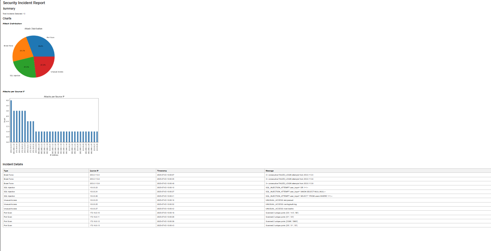

# Security Log Analyzer

A Python tool that monitors server logs for suspicious activity and generates comprehensive security reports.

## Features

This analyzer detects common security threats including:

- **Brute-force attacks** - Multiple failed login attempts from the same source
- **Time-window brute-force** - Coordinated attack patterns within specific time windows
- **SQL injection attempts** - Malicious database queries in logs
- **Unauthorized file access** - Suspicious access to sensitive resources
- **Port scanning activity** - Reconnaissance attempts on multiple ports

## Reports
## HTML template with jinja2
The tool generates an interactive HTML report featuring:

- Detailed attack summaries in table format
- Visual charts showing attack trends

## Getting Started

## Requirements

- Python 3.8+
- Dependencies (install via pip):

### Installation

- pip install -r requirements.txt

## Running the Analyzer

- python3 main.py sample_logs/test.log

## Credits
This project leverages and is inspired by open-source examples:
Pandas DataFrame manipulation – https://github.com/pandas-dev/pandas
Jinja2 HTML templating – https://github.com/pallets/jinja
Note: Some patterns, such as using Pandas for data processing and embedding charts in HTML via Jinja2 templates, were adapted from publicly available examples for educational purposes.

# Sample output
